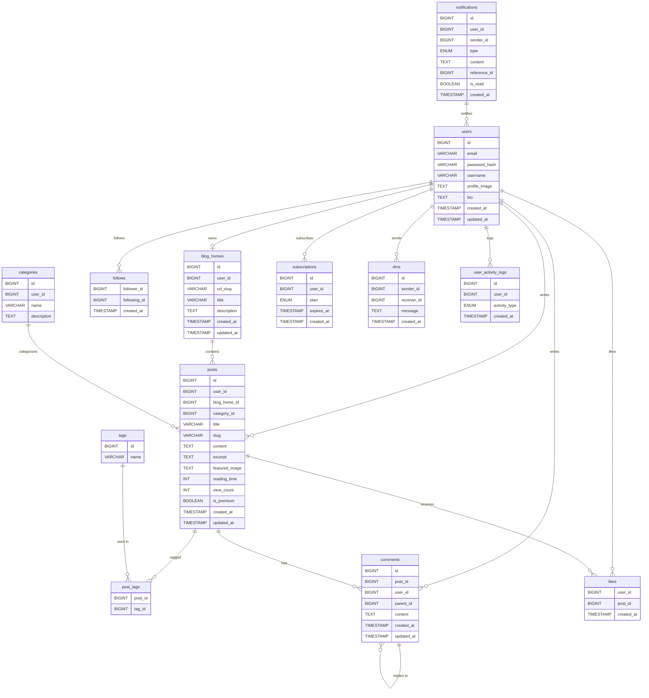
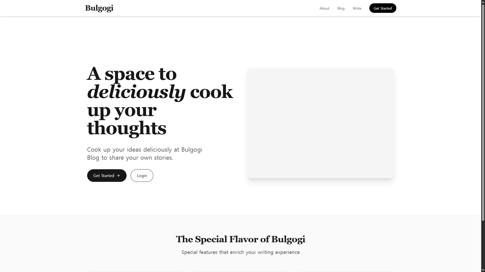
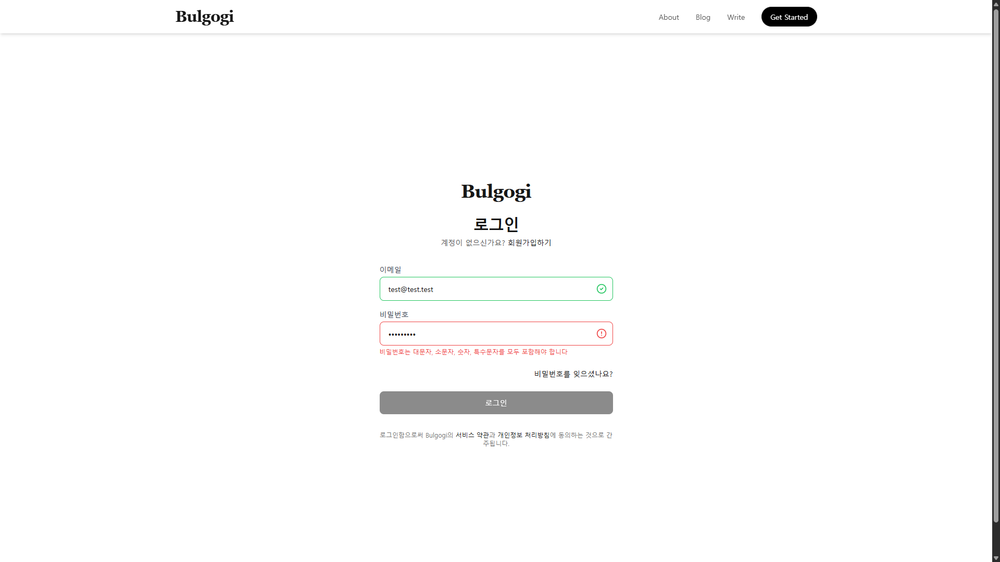
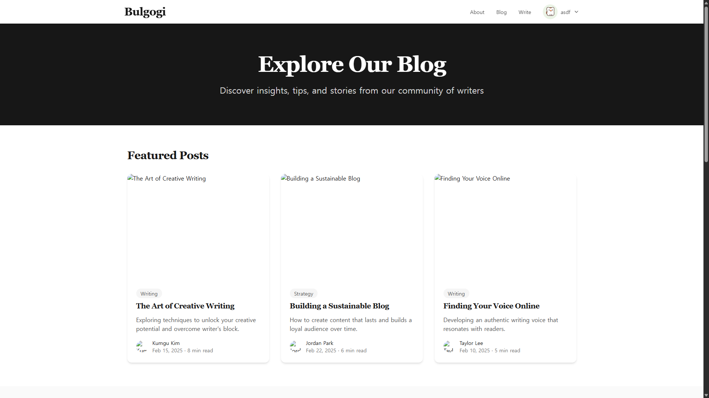
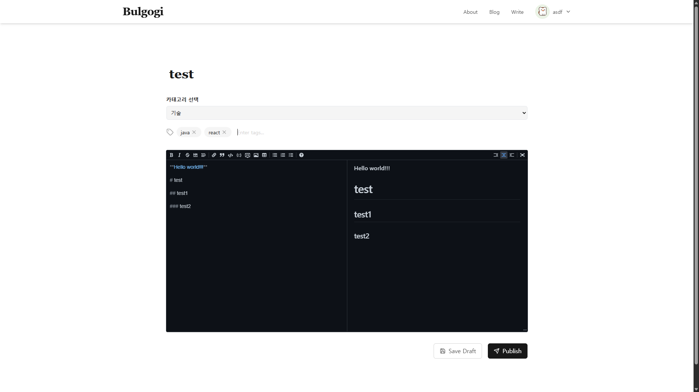
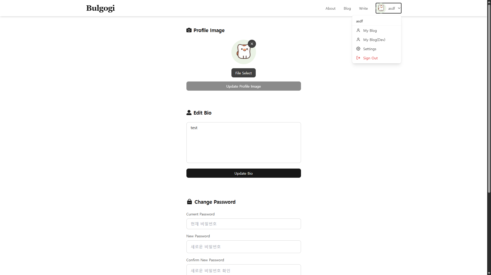

# Bulgogi Blog Platform

Bulgogi는 사용자가 자신의 블로그를 생성하고, 글을 작성하고, 주제와 태그를 중심으로 콘텐츠를 관리할 수 있도록 하는 확장 가능한 블로그 플랫폼입니다. 이 프로젝트는 콘텐츠 기반 서비스를 위한 백엔드 API 서버로, Spring Boot 기반으로 구축되었습니다.

## Overview

- 사용자 인증 및 권한 관리 (JWT)
- 사용자별 블로그 생성 및 관리
- 폴더 기반 카테고리 분류 (개인용 분류)
- 주제(Topic) 및 태그(Tag) 기반 콘텐츠 분류 (글로벌 분류)
- 게시글 작성/수정/삭제 및 이미지 첨부 기능
- 댓글, 좋아요, 팔로우, 알림 시스템

---

## API 문서

- Postman API 문서: [https://documenter.getpostman.com/view/40317640/2sAYdmn8WY](https://documenter.getpostman.com/view/40317640/2sAYdmn8WY)

---

## 기술 스택

### Backend

| 분류 | 기술 |
|------|------|
| Language | Java 17 |
| Framework | Spring Boot |
| ORM | Spring Data JPA (Hibernate) |
| Database | MySQL, Redis |
| 인증 | JWT, Spring Security |
| Build Tool | Gradle |
| 문서화 | Postman, Mermaid (ERD) |
| 배포 대상 | AWS EC2, RDS, S3 (예정) |

### Frontend

| 분류 | 기술 |
|------|------|
| Language | TypeScript |
| Framework | React 19 (React DOM) |
| Router | React Router v7 |
| 상태 관리 | Zustand |
| API 통신 | Axios, React Query (@tanstack/react-query) |
| 마크다운 | @uiw/react-md-editor |
| 아이콘 | lucide-react, react-icons, react-feather |
| 알림 | react-toastify |
| 스타일링 | Tailwind CSS, tailwindcss-animate |
| 번들러 | Vite |
| 정적 검사 | ESLint, TypeScript ESLint |

---

## ERD 요약

- 사용자(`users`)는 블로그 홈(`blog_homes`)을 소유
- 게시글(`posts`)은 특정 블로그와 사용자에 종속
- 게시글은 폴더형 카테고리(`folder_categories`) 및 주제(`topics`)에 연결 가능
- 태그(`tags`)는 다대다 관계로 연결(`post_tags`)
- 댓글(`comments`)은 계층 구조로 구성
- 게시글별 이미지(`post_images`) 및 콘텐츠(`post_contents`)는 별도 테이블에서 관리

---

