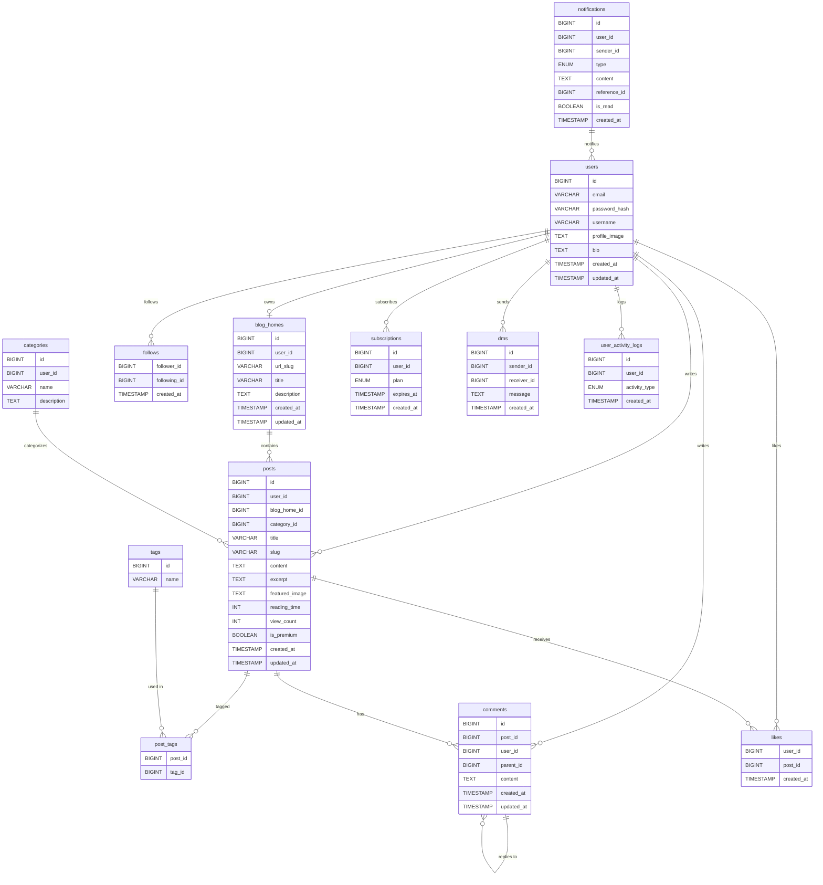

# Bulgogi 블로그 플랫폼 데이터베이스 설계

## ER 다이어그램

### 1. **기본 ER 다이어그램**



### 2. **게시글 관련 ER 다이어그램**


------

## 테이블 설계

### 1. `users` (사용자 정보)

```sql
CREATE TABLE users (
    id BIGINT AUTO_INCREMENT PRIMARY KEY, 
    email VARCHAR(255) UNIQUE NOT NULL, 
    password_hash VARCHAR(255) NOT NULL, 
    username VARCHAR(50) UNIQUE NOT NULL, 
    profile_image TEXT, 
    bio TEXT, 
    created_at TIMESTAMP DEFAULT CURRENT_TIMESTAMP, 
    updated_at TIMESTAMP DEFAULT CURRENT_TIMESTAMP ON UPDATE CURRENT_TIMESTAMP 
);
```

### 2. `blog_homes` (블로그 홈)

```sql
CREATE TABLE blog_homes (
    id BIGINT AUTO_INCREMENT PRIMARY KEY, 
    user_id BIGINT UNIQUE NOT NULL, 
    url_slug VARCHAR(100) UNIQUE NOT NULL, 
    title VARCHAR(255) NOT NULL, 
    description TEXT, 
    created_at TIMESTAMP DEFAULT CURRENT_TIMESTAMP, 
    updated_at TIMESTAMP DEFAULT CURRENT_TIMESTAMP ON UPDATE CURRENT_TIMESTAMP, 
    FOREIGN KEY (user_id) REFERENCES users(id) ON DELETE CASCADE 
);
```

### 3. `posts` (게시글)

```sql
CREATE TABLE posts (
    id BIGINT AUTO_INCREMENT PRIMARY KEY, 
    user_id BIGINT NOT NULL, 
    blog_home_id BIGINT NOT NULL, 
    category_id BIGINT, 
    title VARCHAR(255) NOT NULL, 
    slug VARCHAR(255) UNIQUE NOT NULL, 
    content TEXT NOT NULL, 
    excerpt TEXT, 
    featured_image TEXT, 
    reading_time INT, 
    view_count INT DEFAULT 0, 
    is_premium BOOLEAN DEFAULT FALSE, 
    created_at TIMESTAMP DEFAULT CURRENT_TIMESTAMP, 
    updated_at TIMESTAMP DEFAULT CURRENT_TIMESTAMP ON UPDATE CURRENT_TIMESTAMP, 
    FOREIGN KEY (user_id) REFERENCES users(id) ON DELETE CASCADE, 
    FOREIGN KEY (blog_home_id) REFERENCES blog_homes(id) ON DELETE CASCADE, 
    FOREIGN KEY (category_id) REFERENCES categories(id) ON DELETE SET NULL 
);
```

### 4. `tags` (태그 테이블)

```sql
CREATE TABLE tags (
    id BIGINT AUTO_INCREMENT PRIMARY KEY, 
    name VARCHAR(100) UNIQUE NOT NULL 
);
```

### 5. `post_tags` (게시글-태그 매핑 테이블)

```sql
CREATE TABLE post_tags (
    post_id BIGINT NOT NULL, 
    tag_id BIGINT NOT NULL, 
    PRIMARY KEY (post_id, tag_id), 
    FOREIGN KEY (post_id) REFERENCES posts(id) ON DELETE CASCADE, 
    FOREIGN KEY (tag_id) REFERENCES tags(id) ON DELETE CASCADE 
);
```

### 6. `comments` (댓글)

```sql
CREATE TABLE comments (
    id BIGINT AUTO_INCREMENT PRIMARY KEY, 
    post_id BIGINT NOT NULL, 
    user_id BIGINT NOT NULL, 
    parent_id BIGINT, 
    content TEXT NOT NULL, 
    created_at TIMESTAMP DEFAULT CURRENT_TIMESTAMP, 
    updated_at TIMESTAMP DEFAULT CURRENT_TIMESTAMP ON UPDATE CURRENT_TIMESTAMP, 
    FOREIGN KEY (post_id) REFERENCES posts(id) ON DELETE CASCADE, 
    FOREIGN KEY (user_id) REFERENCES users(id) ON DELETE CASCADE, 
    FOREIGN KEY (parent_id) REFERENCES comments(id) ON DELETE SET NULL 
);
```


#### 7. `post_contents` (게시글 내용)

```sql
CREATE TABLE post_contents (
    id BIGINT AUTO_INCREMENT PRIMARY KEY, 
    post_id BIGINT NOT NULL, 
    content TEXT NOT NULL, 
    FOREIGN KEY (post_id) REFERENCES posts(id) ON DELETE CASCADE 
);
```

#### 8. `post_images` (게시글 이미지)

```sql
CREATE TABLE post_images (
    id BIGINT AUTO_INCREMENT PRIMARY KEY, 
    post_id BIGINT NOT NULL, 
    image_url TEXT NOT NULL, 
    created_at TIMESTAMP DEFAULT CURRENT_TIMESTAMP, 
    FOREIGN KEY (post_id) REFERENCES posts(id) ON DELETE CASCADE 
);
```

#### 9. `topics` (주제)

```sql
CREATE TABLE topics (
    id BIGINT AUTO_INCREMENT PRIMARY KEY, 
    name VARCHAR(255) NOT NULL
);
```

#### 10. `post_folder_categories` (게시글 폴더 카테고리)

```sql
CREATE TABLE post_folder_categories (
    id BIGINT AUTO_INCREMENT PRIMARY KEY, 
    user_id BIGINT NOT NULL, 
    name VARCHAR(255) NOT NULL, 
    FOREIGN KEY (user_id) REFERENCES users(id) ON DELETE CASCADE 
);
```
